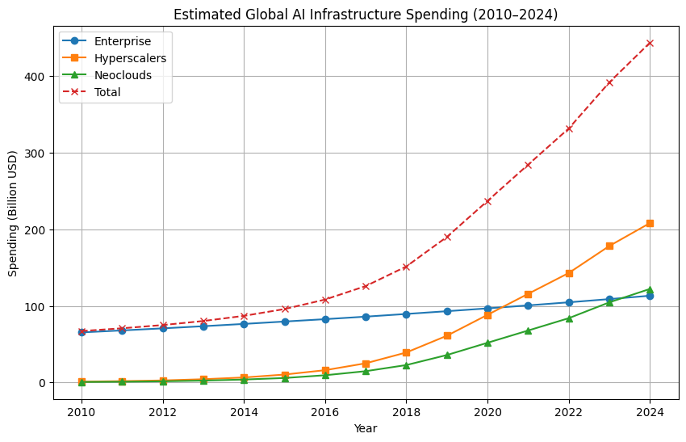
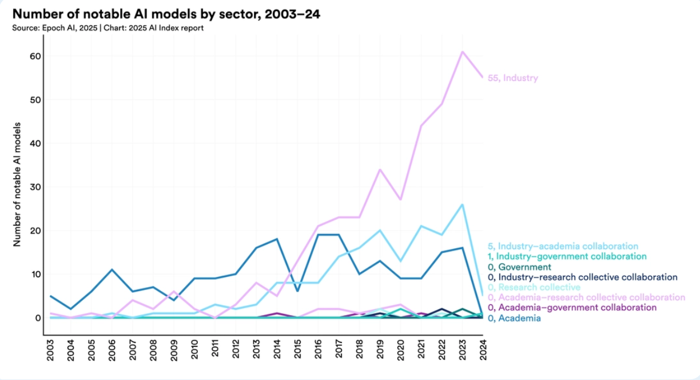
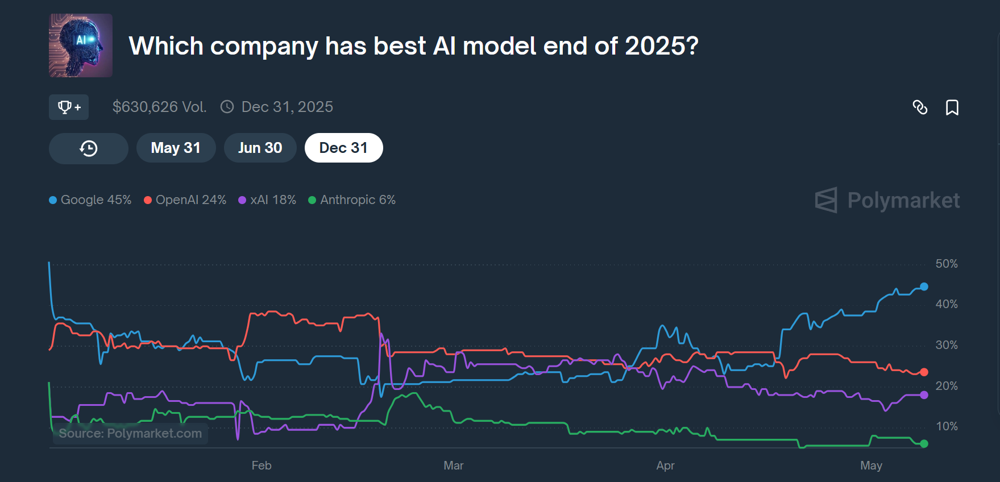
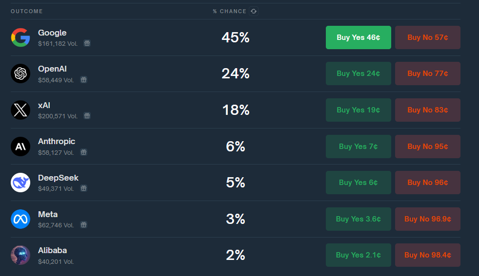
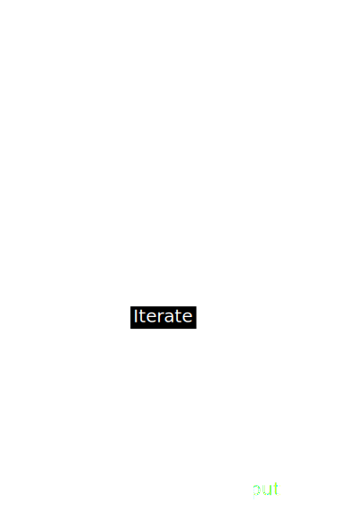

---

enableMenu: false
customTheme: cyber2


---

<!-- .slide: data-background-opacity="0.4" data-background-image="./pics/blob.gif" data-background-color="#000000" -->

## Ai 2025

---

<!-- .slide: -->
### gartner hype cycle


---

> **Calling the Ai-revolution an intelligence explosion is like calling the industralization an horse power explosion** - Tamay Besiroglu 


<aside class="notes">Tamay is a researcher focusing on the Economics of Computing and big-picture trends in machine learning. Previously, he led strategy for Metaculus, consulted for the UK Government, interned at the Future of Humanity Institute at the University of Oxford, and Bloomberg. Tamay received an MPhil in Economics from the University of Cambridge in 2020.</aside>

---

### Agenda

> Trends 

> Engine

> Take aways 

> Implications

<aside class="notes">https://hai-production.s3.amazonaws.com/files/hai_ai_index_report_2025.pdf</aside>


---

## Since last time


<aside class="notes">notes here are - terminal based tools and valuation and growth of LLM using apps code is very much in its own space. Maths and logic</aside>

---

<!-- .slide: data-background-opacity="0.4" data-background-image="./pics/blob.gif" data-background-color="#000000" -->

## Trends

---

> The beaver told the rabbit as they stared at the Hoover Dam: No, I didn’t build it myself, but it’s based on an idea of mine.” 

<aside class=notes>
Old ideas that required enablers to come bloom. 
</aside>


<aside class="notes">hello</aside>

---

### enablers

 - Hardware
 - Capital 
 - People 
 - Algorithms 
 - Data 

--


--


<aside class=notes>
At the hardware level, costs have declined by 30% annually, while energy efficiency has improved by 40% each year.
</aside>

--


<aside class="notes">
Driven by increasingly capable small models, the inference cost for a system performing at the level of GPT-3.5 dropped over 280-fold between November 2022 and October 2024. 
</aside>

--



--


--


--


<aside class="notes">
Nearly 90% of notable AI models in 2024 came from industry, up from 60% in 2023, while academia remains the top source of highly cited research. Model scale continues to grow rapidly—

training compute doubles every five months, 

datasets doubles every eight

power use doubles annually. 
 

</aside>

---

## Whos doing it




--


--



--



--


---

## got llm's -Xbit


```json
GPT-4 release was here (0314)
gpt-4-0613
gpt-4-1106-vision-preview
gpt-4-1106-preview
gpt-4-0125-preview
gpt-4-turbo-2024-04-09
gpt-4-turbo
chatgpt-4o-latest
text-moderation-007
text-moderation-latest
omni-moderation-2024-09-26
omni-moderation-latest
text-embedding-ada-002
text-embedding-3-large
text-embedding-3-small
DALL·E 2
DALL·E 3
TTS HD
TTS
Whisper
gpt-4o-mini-transcribe
gpt-4o-transcribe
gpt-4o-mini-tts
babbage-002
davinci-002
gpt-3.5-turbo
computer-use-preview-2025-03-11
computer-use-preview
gpt-4o-search-preview-2025-03-11
gpt-4o-search-preview
gpt-4o-mini-search-preview-2025-03-11
gpt-4o-mini-search-preview
o1-mini-2024-09-12
o3-mini-2025-01-31
o3-mini
o1-pro-2025-03-19
o1-pro
o1-preview-2024-09-12
o1-2024-12-17
o1
gpt-4o-mini-realtime-preview-2024-12-17
gpt-4o-mini-realtime-preview
gpt-4o-mini-audio-preview-2024-12-17
gpt-4o-mini-audio-preview
gpt-4o-mini-2024-07-18
gpt-4o-mini
gpt-4o-realtime-preview-2024-10-01
gpt-4o-realtime-preview-2024-12-17
gpt-4o-realtime-preview
gpt-4o-audio-preview-2024-10-01
gpt-4o-audio-preview-2024-12-17
gpt-4o-audio-preview
gpt-4o-2024-05-13
gpt-4o-2024-11-20
gpt-4o-2024-08-06
gpt-4o
gpt-4.5-preview-2025-02-27
gpt-4.5-preview
gpt-4.1-nano-2025-04-14
gpt-4.1-nano
gpt-4.1-mini-2025-04-14
gpt-4.1-mini
gpt-4.1-2025-04-14
gpt-4.1

--


<aside class="notes"> the frontier labs find specialiced llms or find prompting techniques that allows for iterating with prompting techiques. Big capable vs many smalls is researched heavily</aside>


---

<!-- .slide: data-background-opacity="0.4" data-background-image="./pics/blob.gif" data-background-color="#000000" -->

## Techniques


--


<aside class="notes">At their core, LLMs operate as prediction engines that take sequential text as input and predict the next token based on the data they were trained on. This process is repeated, adding the predicted token to the sequence to predict the subsequent one. The prediction of the next token is based on the relationships learned from the vast amounts of text in the LLM's training data. </aside>

--

### 1. Temperature

<aside class="notes">Oh hey, these are some notes. They'll be hidden in your presentation, but you can see them if you open the speaker notes window (hit 's' on your keyboard).</aside>

- Temperature controls the probability distribution of the next token.
  - **Low Temperature (e.g., 0)**: The model becomes deterministic, always choosing the most probable token. This is great for precise, factual responses.
  - **High Temperature (e.g., close to 1 or higher)**: The model introduces more randomness, making less probable tokens more likely. This boosts creativity and diversity.
- **Use Case**: Use a low temperature for tasks like answering factual questions and a high temperature for creative tasks like storytelling.


--

### 2. Top-K Sampling
- Top-K limits the model to sampling from the top K most probable tokens at each step.
  - **Low K**: Focuses on a small group of highly likely tokens, making the output more coherent but less diverse.
  - **High K**: Considers more tokens, increasing diversity but possibly reducing focus.
- **Use Case**: Ideal when you want to manually control how many token options the model considers.

--

### 3. Top-P (Nucleus) Sampling
- Top-P selects the smallest set of tokens whose combined probability exceeds a threshold P (e.g., 0.9).
  - **Low P**: Limits the selection to the most probable tokens, keeping the output focused.
  - **High P**: Includes more tokens, adding diversity and creativity.
- **Use Case**: Useful for dynamically balancing coherence and variety based on token probabilities.

--

### 4. Output Length
- This sets the maximum number of tokens the model can generate in its response.
  - **Short Length**: Keeps responses concise and efficient but may cut off detail.
  - **Long Length**: Allows detailed responses but increases computation time and cost.
- **Use Case**: Adjust this to control how verbose or brief the output should be.

---

### Prompt engineering

When you write a prompt, you are essentially trying to set up the LLM to predict the desired sequence of tokens that constitutes your answer or output. Effective prompt engineering involves understanding how the model works and then tinkering with various aspects of the prompt, such as word choice, style, tone, structure, and the context provided, to achieve the desired outcome

--

<aside class="notes">
One-shot and few-shot prompting: These techniques provide the LLM with one or a few examples to demonstrate the desired output format or pattern. This helps the model understand the task better and can steer it towards a specific type of response.
</aside>

1. **Zero Shot**  
   This is the simplest prompting method, where a task description and initial text are provided without any examples. The LLM relies solely on its pre-trained knowledge to produce an output, making it a "zero-shot" approach.    
   
   ```mermaid
   graph LR
   A[Prompt] --> B[Output]
   

--

2. **One-Shot & Few-Shot Prompting**  
   These techniques involve including one example (one-shot) or multiple examples (few-shot) in the prompt to demonstrate the desired output pattern or format, helping the LLM understand the task more effectively.  

   ```mermaid
   graph LR
   A[Prompt with Examples] --> B[Output]
   ```

--

3. **System Prompting**  
   This technique defines the overarching context or purpose for the LLM, such as specifying the task (e.g., classification, translation) or output format (e.g., JSON), guiding the model’s behavior at a high level.  
   
   ```mermaid
   graph LR
   A[System Instruction] --> B[Task Prompt] --> C[Output]
   ```

<aside class=notes>
System, contextual, and role prompting: These techniques allow you to set the overall context and purpose (system prompt), provide specific background information (contextual prompt), or assign a specific character or identity to the LLM (role prompt). This can influence the style, tone, and focus of the LLM's output.
<aside>

--

4. **Contextual Prompting**  
   Provides specific background details or task-relevant information to the prompt, enabling the LLM to tailor its response more accurately to the given scenario.  
   
   ```mermaid
   graph LR
   A[Context] --> B[Task Prompt] --> C[Output]
   ```

--

5. **Role Prompting**  
   Assigns a specific role or persona to the LLM (e.g., travel guide, teacher), directing it to generate responses consistent with that role’s perspective, tone, or expertise.  
   
   ```mermaid
   graph LR
   A[Role Assignment] --> B[Task Prompt] --> C[Output]
   ```

--

6. **Step-Back Prompting**  
   The LLM is first prompted with a general question related to the task to activate broader knowledge, then the answer is used in a subsequent prompt to address the specific task, enhancing reasoning and accuracy.  

   ```mermaid
   graph LR
   A[General Question] --> B[Answer to General Question] --> C[Specific Task Prompt] --> D[Output]
   ```

--


7. **Chain of Thought (CoT)**  
   Encourages the LLM to produce intermediate reasoning steps before delivering the final answer, improving performance on complex tasks by making the thought process explicit.  
   ```mermaid
   graph LR
   A[Prompt] --> B[Reasoning Step 1] --> C[Reasoning Step 2] --> D[Final Answer]
   ```

--

8. **Self-Consistency**  
   The LLM generates multiple responses to the same prompt using varied reasoning paths (often with higher temperature settings), then selects the most consistent answer to improve reliability.  
   ```mermaid
   graph LR
   A[Prompt] --> B[Response 1]
   A --> C[Response 2]
   A --> D[Response 3]
   B --> E[Select Most Consistent]
   C --> E
   D --> E
   E --> F[Final Output]
   ```

--

9. **Tree of Thoughts (ToT)**  
   Explores multiple reasoning paths or ideas in a branching structure, allowing the LLM to consider various possibilities before converging on a final output, useful for deliberate problem-solving.  
   ```mermaid
   graph TD
   A[Prompt] --> B[Thought 1]
   A --> C[Thought 2]
   B --> D[Subthought 1.1]
   B --> E[Subthought 1.2]
   C --> F[Subthought 2.1]
   D --> G[Final Output]
   E --> G
   F --> G
   ```

---

### agents
> Ai agents are just a bunch of python scripts and an api key  


---

### Reflection




---

### Tools


---

### Planning


---

### Multi agent


---


### Example

```python
# 1. Tools - The agent's capabilities
def list_tables(reasoning: str) -> List[str]:
    """Returns a list of tables in the database."""
    # Tool implementation...

def describe_table(reasoning: str, table_name: str) -> str:
    """Returns schema information about the specified table."""
    # Tool implementation...

# 2. Agent Prompt - The agent's instructions
AGENT_PROMPT = """
<purpose>
    You are a world-class expert at crafting precise DuckDB SQL queries.
    Your goal is to generate accurate queries that exactly match the user's data needs.
</purpose>

<instructions>
    <instruction>Use the provided tools to explore the database...</instruction>
    <instruction>Think step by step about what information you need.</instruction>
</instructions>
"""

# 3. Main execution
def main():
    # Initialize agent
    # Process user input
    # Execute tools based on reasoning
```

--

### How LangChain Enables AI Agents
- **Reason**: Use LLMs to plan or make decisions.
- **Act**: Call tools to interact with the world (e.g., APIs, databases).
- **Remember**: Maintain context across interactions.
- **Adapt**: Handle diverse tasks by swapping tools or prompts.


--

### LangChain for AI Agents
1. **LLMs and Chat Models**:
   - LangChain integrates with LLMs (e.g., OpenAI’s GPT, Anthropic’s Claude, or open-source models via Hugging Face) using API keys.
   - It abstracts the interaction, allowing agents to call models for generating text, answering questions, or making decisions.

--

2. **Prompt Templates**:
   - LangChain provides templating to craft structured prompts that guide the LLM’s behavior. For example, an agent might use a template like:  
     ```
     You are a helpful assistant. Given the user query: {query}, provide a concise answer and suggest a follow-up action.
     ```
   - This ensures consistent and task-specific responses, critical for agents performing roles like customer support or task planning.

--

3. **Memory**:
   - Agents need context to maintain coherent interactions. LangChain offers memory modules to store and retrieve conversation history or task state.
   - Types include:
     - **ConversationBufferMemory**: Stores the full chat history.
     - **ConversationSummaryMemory**: Summarizes past interactions to save tokens.
     - **VectorStore-backed Memory**: Uses embeddings to retrieve relevant past interactions for long-term context.
   - Example: An agent helping with project management can recall prior tasks or user preferences.

--

4. **Tools**:
   - LangChain allows agents to interact with external systems via tools, which are Python functions or APIs. Examples:
     - **Web Search**: Use APIs like SerpAPI to fetch real-time data.
     - **Calculators**: Integrate with libraries like `numexpr` for math tasks.
     - **Custom Tools**: Write Python functions for specific tasks, like querying a database.
   - Agents decide which tool to use based on the task, often guided by the LLM’s reasoning.

--

5. **Chains**:
   - Chains are sequences of actions (e.g., prompt → LLM → tool → output). LangChain’s `SequentialChain` or `RouterChain` lets agents follow multi-step workflows.
   - Example: A research agent might:
     1. Take a query.
     2. Search the web.
     3. Summarize findings.
     4. Store results in memory.

--

6. **Agents**:
   - LangChain’s agent module combines LLMs, tools, and memory to create autonomous systems. Key agent types:
     - **ReAct (Reasoning + Acting)**: The agent reasons about the task, selects a tool, acts, observes the result, and repeats until the goal is met.
     - **Plan-and-Execute**: The agent plans steps upfront, then executes them.
     - **Tool-calling Agents**: Directly map tasks to specific tools based on LLM output.
   - Example: A ReAct agent tasked with “Find the weather in Tokyo” might:
     1. Reason: “I need real-time weather data.”
     2. Select: A weather API tool.
     3. Act: Query the API.
     4. Return: “It’s 22°C and sunny in Tokyo.”

--

7. **Vector Stores and Retrieval**:
   - LangChain integrates with vector databases (e.g., FAISS, Pinecone) to store and retrieve information using embeddings.
   - For agents, this enables retrieval-augmented generation (RAG), where the agent pulls relevant documents or past interactions to inform its response.
   - Example: A customer support agent retrieves product manuals to answer technical questions.


--

### Example: Building a Simple LangChain Agent
Here’s a basic Python example of a LangChain agent that answers questions using a web search tool:

```python
from langchain_openai import ChatOpenAI
from langchain.agents import initialize_agent, Tool
from langchain.utilities import SerpAPIWrapper

# Set up the LLM (requires an API key)
llm = ChatOpenAI(model="gpt-4", openai_api_key="your_openai_api_key")

# Set up a web search tool
search = SerpAPIWrapper(serpapi_api_key="your_serpapi_api_key")
tools = [
    Tool(
        name="Search",
        func=search.run,
        description="Useful for answering questions about current events or data."
    )
]

# Initialize the agent
agent = initialize_agent(
    tools=tools,
    llm=llm,
    agent_type="zero-shot-react-description",
    verbose=True
)

# Run the agent
response = agent.run("What’s the latest news on AI advancements?")
print(response)
```

### Workflow in the Example
1. **Input**: User asks about AI advancements.
2. **Reasoning**: The agent (using ReAct) decides a web search is needed.
3. **Action**: Calls the SerpAPI tool to fetch recent articles.
4. **Output**: Summarizes findings and returns a response.

### Why LangChain for AI Agents?
- **Flexibility**: Mix and match LLMs, tools, and memory types.
- **Scalability**: Handle complex workflows with chains and retrieval.
- **Ease of Use**: Abstracts low-level API calls and prompt engineering.
- **Extensibility**: Add custom tools or integrate with any API.

### Limitations
- **Complexity**: Steep learning curve for advanced features like custom chains.
- **Cost**: Relies on paid APIs (e.g., OpenAI, SerpAPI) for full functionality.
- **Performance**: Dependent on the quality of the underlying LLM and tools.


---


> "If Claude is asked to count words, letters, and characters, it thinks step by step before answering the person. It explicitly counts the words, letters, or characters by assigning a number to each. It only answers the person once it has performed this explicit counting step."

This is to help Claude solve 'r' in strawberry etc

<aside class=notes>I was prompted to jot down this shower of thoughts after reading through Claude's system prompt, which currently seems to be around 17,000 words, specifying not just basic behavior style/preferences (e.g. refuse various requests related to song lyrics) but also a large amount of general problem solving strategies, e.g.: </aside>

---


### MCP

> provides a structured way to connect AI agents with external tools

---

### Google Maps MCP

```python
# MCP Protocol Definition
maps_geocode = {
    "input": "address (string)",
    "returns": ["location", "formatted_address", "place_id"]
}

maps_reverse_geocode = {
    "inputs": {
        "latitude": "number",
        "longitude": "number"
    },
    "returns": ["formatted_address", "place_id", "address_components"]
}

maps_search_places = {
    "inputs": {
        "query": "string",
        "location": "optional: { latitude: number, longitude: number }",
        "radius": "optional: number (meters, max 50000)"
    },
    "returns": "array of places with names, addresses, locations"
}

```

---

## A2A

> provides as structured way to connect AI agents with other AI agents

--

```json
{
  "name": "Weather Agent",
  "description": "Provides current weather information",
  "url": "https://weather-agent.example.com",
  "version": "1.0.0",
  "authentication": {
    "schemes": ["OAuth2"]
  },
  "defaultInputModes": ["text/plain"],
  "defaultOutputModes": ["application/json"],
  "capabilities": {
    "streaming": false,
    "pushNotifications": true
  },
  "skills": [
    {
      "id": "get-weather",
      "name": "Weather Forecast",
      "description": "Retrieves weather data for a given location",
      "tags": ["weather", "forecast"],
      "examples": ["Get weather for New York", "Forecast for London"]
    }
  ]
}

---

>"The primary audience of your thing (product, service, library, …) is now an LLM, not a human.
LLMs don’t like to navigate, they like to scrape.
LLMs don’t like to see, they like to read.
LLMs don’t like to click, they like to curl."- Andrej Karpathy 

---

<!-- .slide: data-background-opacity="0.4" data-background-image="./pics/blob.gif" data-background-color="#000000" -->

## Take aways

---

Understand the strat...

A LLM model is a destilled version of all text. You want to narrow the scope for its search 

--

So its not right..

Probablistic engine not deterministic. Tests, examples, reiteration building determenistic behaviour is going to be the new skill. 

--

Sunken costs beware...

Massive codebases with known behaviour and complete example set of input/output are now not worth. Reimplementations are pretty much costless

---

<!-- .slide: data-background-opacity="0.4" data-background-image="./pics/blob.gif" data-background-color="#000000" -->

## Implications

---

> "The future is already here – it's just not evenly distributed." - William Gibson


<aside class=notes> 
Andrej - llms give everyone a chance. We all have access to the best llms. 
Every one can do most things
this is a new Operating system to the compute.
</aside>

---

Lets bounce of Sebastian CEO of klarna 
https://x.com/klarnaseb/status/1912436205985333688

---

> Delegation always had flaws, Telephone game. More and more doing yourself produces better results than delegating for lots of stuff

---

> Iterate even faster, prototype things. I used to bring an idea to a meeting. Now I bring a Lovable prototype. Not because it is perfect but it articulates the idea

---

> Massive requirements on managers to test things. Stay curious. Explore learn and do themselves. They need to embrace and lean it. Be courages to show themselves “weak” and embrace uncertainty. Say “I don’t understand”
and ask ask ask.

---

> Challenges are now more than ever organizational not technical. Do
I have the right people for this challenge? Are they using AI correctly? Are others in the company doing similar stuff? Are we moving at the pace we need to? Am
I more driven by results or size of org I manage?

---

> “There is nothing more dangerous than yesterday’s success" - Carl Eschenbach

---

## Mentimerter time

https://www.mentimeter.com/app/presentation/al79bou5b35scyzkv98y6qsbo2ydin2a/edit?question=nhmd4i2vd4xq

- hype or new world

- fixed pie or massive new value

- replaced or accellerated

---


