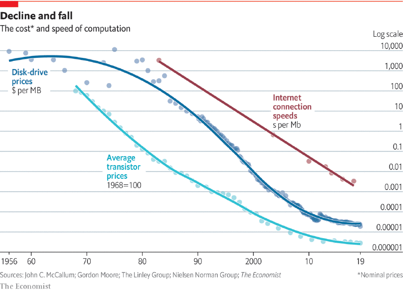
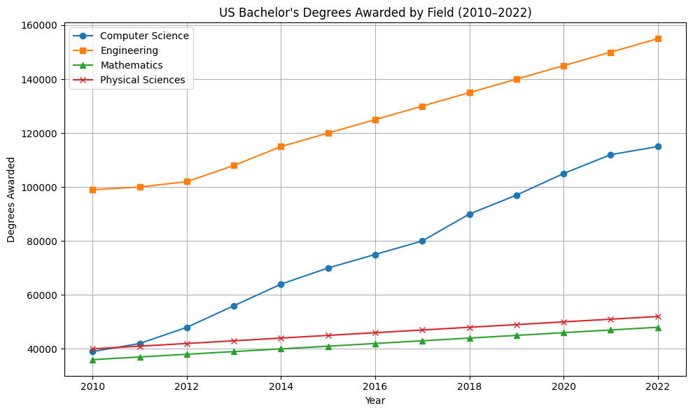
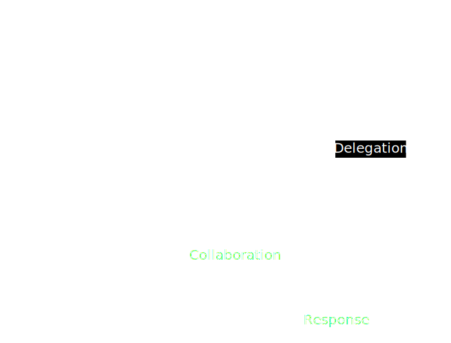

---

enableMenu: false
customTheme: cyber2


---

<!-- .slide: data-background-opacity="0.4" data-background-image="./pics/blob.gif" data-background-color="#000000" -->

# Ai 2025

---

<!-- .slide: -->
### gartner hype cycle


---

> **Calling the Ai-revolution an intelligence explosion is like calling the industralization an horse power explosion** - Tamay Besiroglu 


<aside class="notes">Tamay is a researcher focusing on the Economics of Computing and big-picture trends in machine learning. Previously, he led strategy for Metaculus, consulted for the UK Government, interned at the Future of Humanity Institute at the University of Oxford, and Bloomberg. Tamay received an MPhil in Economics from the University of Cambridge in 2020.</aside>

---

### Agenda

> Trends 

> Techniques

> Implications 

<aside class="notes">https://hai-production.s3.amazonaws.com/files/hai_ai_index_report_2025.pdf</aside>

---
https://hai.stanford.edu/ai-index/2025-ai-index-report

---

## timeline
<!-- .slide: data-fullscreen-->


<aside class="notes">notes here are - terminal based tools and valuation and growth of LLM using apps</aside>

---

> The beaver told the rabbit as they stared at the Hoover Dam: No, I didn’t build it myself, but it’s based on an idea of mine.” 


<aside class="notes"></aside>

---

### enablers

1. Hardware
2. Capital
3. People
4. Algoritms
5. Data

--



--


--


--




<aside class="notes">
**Data & Corpus**
   - Massive text datasets for training
   - Not only seminal, offical texts but conversations and peoples use internet for two decades plus.

   
</aside>

---

## Whos doing it
--


--


--


--


--


---

#### The Gutenberg Analogy

> "Writing has been around for long, but only when many can read it makes sense for a Gutenberg revolution"

- Ideas existed for decades
- Enablers made implementation possible
- Critical mass of adoption needed
- Infrastructure enables innovation

---

### Still a next token machine

--


<aside class="notes">At their core, LLMs operate as prediction engines that take sequential text as input and predict the next token based on the data they were trained on. This process is repeated, adding the predicted token to the sequence to predict the subsequent one. The prediction of the next token is based on the relationships learned from the vast amounts of text in the LLM's training data. </aside>

--

### 1. Temperature

<aside class="notes">Oh hey, these are some notes. They'll be hidden in your presentation, but you can see them if you open the speaker notes window (hit 's' on your keyboard).</aside>

- Temperature controls the probability distribution of the next token.
  - **Low Temperature (e.g., 0)**: The model becomes deterministic, always choosing the most probable token. This is great for precise, factual responses.
  - **High Temperature (e.g., close to 1 or higher)**: The model introduces more randomness, making less probable tokens more likely. This boosts creativity and diversity.
- **Use Case**: Use a low temperature for tasks like answering factual questions and a high temperature for creative tasks like storytelling.


--

### 2. Top-K Sampling
- Top-K limits the model to sampling from the top K most probable tokens at each step.
  - **Low K**: Focuses on a small group of highly likely tokens, making the output more coherent but less diverse.
  - **High K**: Considers more tokens, increasing diversity but possibly reducing focus.
- **Use Case**: Ideal when you want to manually control how many token options the model considers.

--

### 3. Top-P (Nucleus) Sampling
- Top-P selects the smallest set of tokens whose combined probability exceeds a threshold P (e.g., 0.9).
  - **Low P**: Limits the selection to the most probable tokens, keeping the output focused.
  - **High P**: Includes more tokens, adding diversity and creativity.
- **Use Case**: Useful for dynamically balancing coherence and variety based on token probabilities.

--

### 4. Output Length
- This sets the maximum number of tokens the model can generate in its response.
  - **Short Length**: Keeps responses concise and efficient but may cut off detail.
  - **Long Length**: Allows detailed responses but increases computation time and cost.
- **Use Case**: Adjust this to control how verbose or brief the output should be.

---

### Prompt engineering

When you write a prompt, you are essentially trying to set up the LLM to predict the desired sequence of tokens that constitutes your answer or output. Effective prompt engineering involves understanding how the model works and then tinkering with various aspects of the prompt, such as word choice, style, tone, structure, and the context provided, to achieve the desired outcome

--

One-shot and few-shot prompting: These techniques provide the LLM with one or a few examples to demonstrate the desired output format or pattern. This helps the model understand the task better and can steer it towards a specific type of response.

1. **Zero Shot**  
   This is the simplest prompting method, where a task description and initial text are provided without any examples. The LLM relies solely on its pre-trained knowledge to produce an output, making it a "zero-shot" approach.    
   
   ```mermaid
   graph LR
   A[Prompt] --> B[Output]
   

--

2. **One-Shot & Few-Shot Prompting**  
   These techniques involve including one example (one-shot) or multiple examples (few-shot) in the prompt to demonstrate the desired output pattern or format, helping the LLM understand the task more effectively.  

   ```mermaid
   graph LR
   A[Prompt with Examples] --> B[Output]
   ```

--

System, contextual, and role prompting: These techniques allow you to set the overall context and purpose (system prompt), provide specific background information (contextual prompt), or assign a specific character or identity to the LLM (role prompt). This can influence the style, tone, and focus of the LLM's output.

3. **System Prompting**  
   This technique defines the overarching context or purpose for the LLM, such as specifying the task (e.g., classification, translation) or output format (e.g., JSON), guiding the model’s behavior at a high level.  
   
   ```mermaid
   graph LR
   A[System Instruction] --> B[Task Prompt] --> C[Output]
   ```

--

4. **Contextual Prompting**  
   Provides specific background details or task-relevant information to the prompt, enabling the LLM to tailor its response more accurately to the given scenario.  
   
   ```mermaid
   graph LR
   A[Context] --> B[Task Prompt] --> C[Output]
   ```

--

5. **Role Prompting**  
   Assigns a specific role or persona to the LLM (e.g., travel guide, teacher), directing it to generate responses consistent with that role’s perspective, tone, or expertise.  
   
   ```mermaid
   graph LR
   A[Role Assignment] --> B[Task Prompt] --> C[Output]
   ```

--

6. **Step-Back Prompting**  
   The LLM is first prompted with a general question related to the task to activate broader knowledge, then the answer is used in a subsequent prompt to address the specific task, enhancing reasoning and accuracy.  

   ```mermaid
   graph LR
   A[General Question] --> B[Answer to General Question] --> C[Specific Task Prompt] --> D[Output]
   ```

--


7. **Chain of Thought (CoT)**  
   Encourages the LLM to produce intermediate reasoning steps before delivering the final answer, improving performance on complex tasks by making the thought process explicit.  
   ```mermaid
   graph LR
   A[Prompt] --> B[Reasoning Step 1] --> C[Reasoning Step 2] --> D[Final Answer]
   ```

--

8. **Self-Consistency**  
   The LLM generates multiple responses to the same prompt using varied reasoning paths (often with higher temperature settings), then selects the most consistent answer to improve reliability.  
   ```mermaid
   graph LR
   A[Prompt] --> B[Response 1]
   A --> C[Response 2]
   A --> D[Response 3]
   B --> E[Select Most Consistent]
   C --> E
   D --> E
   E --> F[Final Output]
   ```

--

9. **Tree of Thoughts (ToT)**  
   Explores multiple reasoning paths or ideas in a branching structure, allowing the LLM to consider various possibilities before converging on a final output, useful for deliberate problem-solving.  
   ```mermaid
   graph TD
   A[Prompt] --> B[Thought 1]
   A --> C[Thought 2]
   B --> D[Subthought 1.1]
   B --> E[Subthought 1.2]
   C --> F[Subthought 2.1]
   D --> G[Final Output]
   E --> G
   F --> G
   ```

---

### agents
> Ai agents are just a bunch of python scripts and an api key  


---

### Reflection


---

### Tools


---

### Planning


---

### Multi agent




---


### Example

```python
# 1. Tools - The agent's capabilities
def list_tables(reasoning: str) -> List[str]:
    """Returns a list of tables in the database."""
    # Tool implementation...

def describe_table(reasoning: str, table_name: str) -> str:
    """Returns schema information about the specified table."""
    # Tool implementation...

# 2. Agent Prompt - The agent's instructions
AGENT_PROMPT = """
<purpose>
    You are a world-class expert at crafting precise DuckDB SQL queries.
    Your goal is to generate accurate queries that exactly match the user's data needs.
</purpose>

<instructions>
    <instruction>Use the provided tools to explore the database...</instruction>
    <instruction>Think step by step about what information you need.</instruction>
</instructions>
"""

# 3. Main execution
def main():
    # Initialize agent
    # Process user input
    # Execute tools based on reasoning
```

---

### MCP

> provides a structured way to connect AI agents with external tools

--

### Google Maps MCP

```python
# MCP Protocol Definition
maps_geocode = {
    "input": "address (string)",
    "returns": ["location", "formatted_address", "place_id"]
}

maps_reverse_geocode = {
    "inputs": {
        "latitude": "number",
        "longitude": "number"
    },
    "returns": ["formatted_address", "place_id", "address_components"]
}

maps_search_places = {
    "inputs": {
        "query": "string",
        "location": "optional: { latitude: number, longitude: number }",
        "radius": "optional: number (meters, max 50000)"
    },
    "returns": "array of places with names, addresses, locations"
}

```

--

## A2A

> provides as structured way to connect AI agents with other AI agents

--

```json
{
  "name": "Weather Agent",
  "description": "Provides current weather information",
  "url": "https://weather-agent.example.com",
  "version": "1.0.0",
  "authentication": {
    "schemes": ["OAuth2"]
  },
  "defaultInputModes": ["text/plain"],
  "defaultOutputModes": ["application/json"],
  "capabilities": {
    "streaming": false,
    "pushNotifications": true
  },
  "skills": [
    {
      "id": "get-weather",
      "name": "Weather Forecast",
      "description": "Retrieves weather data for a given location",
      "tags": ["weather", "forecast"],
      "examples": ["Get weather for New York", "Forecast for London"]
    }
  ]
}

---

>"The primary audience of your thing (product, service, library, …) is now an LLM, not a human.
LLMs don’t like to navigate, they like to scrape.
LLMs don’t like to see, they like to read.
LLMs don’t like to click, they like to curl."- Andrej Karpathy 

---

If an LLM model is a destilled version of all text. all use  of it is a way to narrow the scope for its search or associciation 

---

```json
GPT-4 release was here (0314)

gpt-4-0613
gpt-4-1106-vision-preview
gpt-4-1106-preview
gpt-4-0125-preview
gpt-4-turbo-2024-04-09
gpt-4-turbo
chatgpt-4o-latest
text-moderation-007
text-moderation-latest
omni-moderation-2024-09-26
omni-moderation-latest
text-embedding-ada-002
text-embedding-3-large
text-embedding-3-small
DALL·E 2
DALL·E 3
TTS HD
TTS
Whisper
gpt-4o-mini-transcribe
gpt-4o-transcribe
gpt-4o-mini-tts
babbage-002
davinci-002
gpt-3.5-turbo
computer-use-preview-2025-03-11
computer-use-preview
gpt-4o-search-preview-2025-03-11
gpt-4o-search-preview
gpt-4o-mini-search-preview-2025-03-11
gpt-4o-mini-search-preview
o1-mini-2024-09-12
o3-mini-2025-01-31
o3-mini
o1-pro-2025-03-19
o1-pro
o1-preview-2024-09-12
o1-2024-12-17
o1
gpt-4o-mini-realtime-preview-2024-12-17
gpt-4o-mini-realtime-preview
gpt-4o-mini-audio-preview-2024-12-17
gpt-4o-mini-audio-preview
gpt-4o-mini-2024-07-18
gpt-4o-mini
gpt-4o-realtime-preview-2024-10-01
gpt-4o-realtime-preview-2024-12-17
gpt-4o-realtime-preview
gpt-4o-audio-preview-2024-10-01
gpt-4o-audio-preview-2024-12-17
gpt-4o-audio-preview
gpt-4o-2024-05-13
gpt-4o-2024-11-20
gpt-4o-2024-08-06
gpt-4o
gpt-4.5-preview-2025-02-27
gpt-4.5-preview
gpt-4.1-nano-2025-04-14
gpt-4.1-nano
gpt-4.1-mini-2025-04-14
gpt-4.1-mini
gpt-4.1-2025-04-14
gpt-4.1

---


<aside class="notes"> the frontier labs find specialiced llms or find prompting techniques that allows for iterating with prompting techiques. Big capable vs many smalls is researched heavily</aside>


---

> "The future is already here – it's just not evenly distributed." - William Gibson

---


---

Implications for lynx


> “There is nothing more dangerous than yesterday’s success - Carl Eschenbach”

---

depending on where you put the fenomen on the gartner hype graph

depending on you view this as a fixed pie or massive value proposition

depending on 

- faster horses. 1 horse for every 10. Or a new world with highways and cars.

---

## oodla - loop
 observe
 origent
 descide
 act

 the speed of this loop during turbulent times is paramount

 ---

 case study; data platform

 - first conferences and discussions 2022
 - article seminars; research, systems,exectution, data 
 - 2025; 3 month 3 ppl fulltime 1 fulltime consultant for a prestudy; 
  descided what tools to use.
 - what whould the equity group have done during the same insights 3 years ago?

 is this our oodla loop for change?

---

Mentimeter - 
  risk vs reward
  fear vs hope 
  Process vs Outcome driven development
  Task vs Goal oriented leadership


---

industry
 - CEO of snowflake

 - CTO of Palantir

 - CEO of Klarna

 - CEO of 80/20


