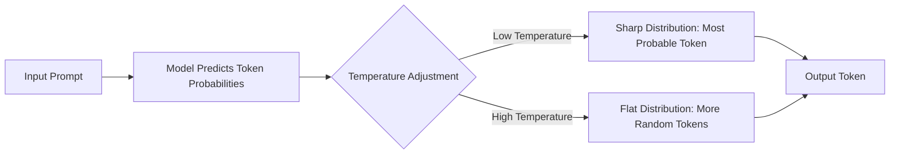
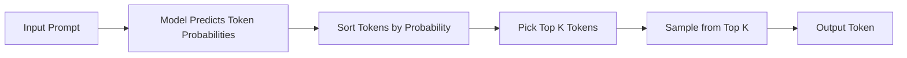
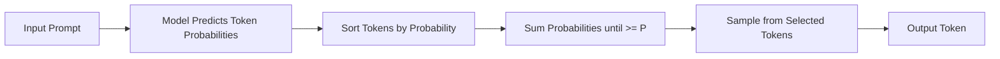
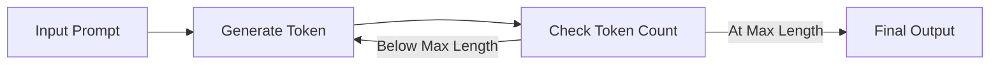
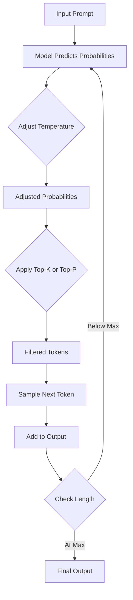

---

---

---

## Summary of Key Parameters

When working with LLMs, adjusting certain parameters allows you to fine-tune the output to suit specific tasks. Here’s an overview of the main parameters:

### 1. Temperature
- **Definition**: Temperature controls how random or predictable the model’s output is by adjusting the probability distribution of the next token.
- **Effect**:
  - **Low Temperature (e.g., 0)**: The model becomes deterministic, always choosing the most probable token. This is great for precise, factual responses.
  - **High Temperature (e.g., close to 1 or higher)**: The model introduces more randomness, making less probable tokens more likely. This boosts creativity and diversity.
- **Use Case**: Use a low temperature for tasks like answering factual questions and a high temperature for creative tasks like storytelling.

### 2. Top-K Sampling
- **Definition**: Top-K limits the model to sampling from the top K most probable tokens at each step.
- **Effect**:
  - **Low K**: Focuses on a small group of highly likely tokens, making the output more coherent but less diverse.
  - **High K**: Considers more tokens, increasing diversity but possibly reducing focus.
- **Use Case**: Ideal when you want to manually control how many token options the model considers.

### 3. Top-P (Nucleus) Sampling
- **Definition**: Top-P selects the smallest set of tokens whose combined probability exceeds a threshold P (e.g., 0.9).
- **Effect**:
  - **Low P**: Limits the selection to the most probable tokens, keeping the output focused.
  - **High P**: Includes more tokens, adding diversity and creativity.
- **Use Case**: Useful for dynamically balancing coherence and variety based on token probabilities.

### 4. Output Length
- **Definition**: This sets the maximum number of tokens the model can generate in its response.
- **Effect**:
  - **Short Length**: Keeps responses concise and efficient but may cut off detail.
  - **Long Length**: Allows detailed responses but increases computation time and cost.
- **Use Case**: Adjust this to control how verbose or brief the output should be.

---

## How These Parameters Work Together
- **Temperature** tweaks the probability of all possible tokens before sampling begins.
- **Top-K** and **Top-P** filter which tokens the model can choose from:
  - Top-K uses a fixed number of tokens.
  - Top-P uses a probability threshold.
- These can be combined with temperature to shape the output’s style.
- **Output Length** caps the total number of tokens generated, regardless of other settings.

---

## Mermaid Diagrams

Here are visual representations of how each parameter affects the token generation process.

### 1. Temperature
This shows how temperature changes the likelihood of token selection.

- Low temperature sharpens the focus on the top token.
- High temperature spreads the chances across more tokens.

### 2. Top-K Sampling
This illustrates how top-K narrows down the token options.

- Only the top K tokens are considered for sampling.

### 3. Top-P Sampling
This shows how top-P dynamically selects tokens based on cumulative probability.

- The model picks tokens until their combined probability hits the P threshold.

### 4. Output Length
This depicts how output length limits the generation process.

- Generation stops when the token limit is reached.

### Combined Process
This diagram ties all parameters together in the token generation flow.

- Temperature adjusts probabilities, top-K/top-P filter tokens, and output length caps the process.

---

## Conclusion
Temperature, top-K, top-P, and output length are powerful tools in prompt engineering. They let you control how creative, coherent, or concise an LLM’s response is. By tweaking these settings, you can tailor the model’s output to fit your needs—whether it’s a short, factual answer or a long, imaginative story. The Mermaid diagrams above should help you visualize how each parameter shapes the process. Let me know if you’d like more details!