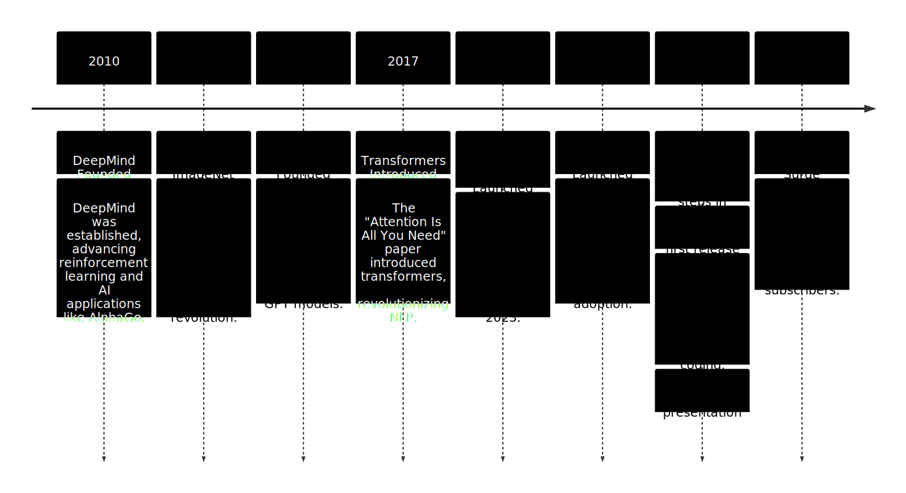
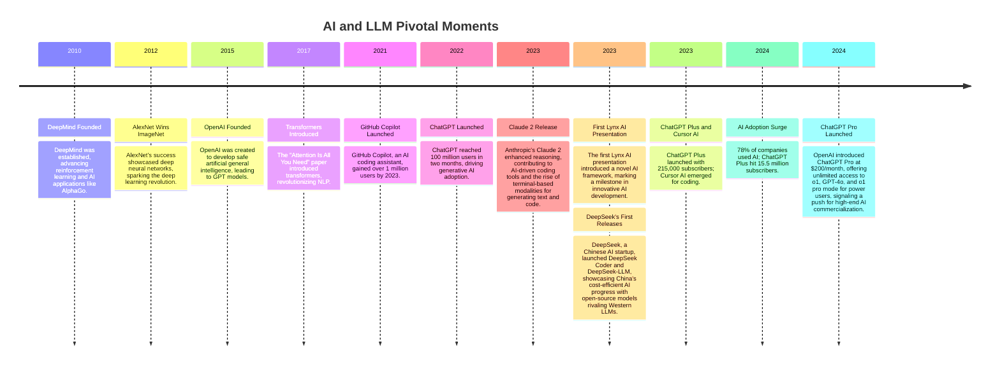

---

---

<!-- .slide: data-background-opacity="0.4" data-background-image="./gifs/start.gif" data-background-color="#000000" -->

## Ai 2025

---

<!-- .slide: data-background-opacity="0.1" data-background-image="./gifs/start.gif" data-background-color="#000000" -->

> **Calling the Ai-revolution an intelligence explosion is like calling the industralization an horse power explosion** - Tamay Besiroglu 

---

## timeline

---

---